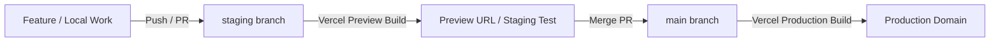

# Bakaiti — Private Friend Group Chat & AI Hub

[](https://nextjs.org/)
[](https://supabase.com/)
[](https://deepmind.google/technologies/gemini/)
[](https://vercel.com/)
[](LICENSE)

**Bakaiti** is a modern, private, real-time messaging web app and Android mobile application built for friend groups. It features Gemini AI integration (`@Bakait`, `/roast`, `/chaos`, `/remember`, `/meme`), custom sticker packs, iOS-compatible voice notes, custom chat themes, squad analytics (`/simps`, `/ghost-meter`), and admin-approved signups.

---

## 🌟 Key Features

- **🔐 Private Squad Isolation**: Admin approval required for signups. No public directory or unwanted messages.
- **🤖 Gemini AI Integration (`@Bakait`)**: Mention `@Bakait` or run slash commands to roast chat context, generate breaking news (`/chaos`), dig up past quotes (`/remember`), or generate meme SVGs (`/meme`).
- **💬 Real-Time Messaging & DMs**: Direct messages, group chats, typing indicators, online status dots, and live read receipts (✓ / ✓✓).
- **🎨 6 Theme Presets**: Default Light/Dark, Sunset Orange, Cyberpunk Neon, Discord Night, WhatsApp Emerald, and Matrix Terminal.
- **🎙️ HD Audio Notes & Media Lightbox**: Record and play voice messages on Web & iOS Safari. Expand photos & videos in a clean lightbox view.
- **📊 Squad Analytics**: Leaderboards for reply speeds (`/simps`) and read-ghosting frequency (`/ghost-meter`).
- **📱 PWA & Native Android APK**: Installable PWA with Service Worker push notifications + native Android APK powered by Capacitor.

---

## 🏗️ Tech Stack & Architecture

- **Frontend**: Next.js 16 (App Router), Tailwind CSS v4, Lucide Icons, Radix UI.
- **Backend & Database**: PostgreSQL on Supabase, Supabase Realtime Broadcasts, Supabase Storage.
- **AI & ML**: Google Gemini 2.0 Flash API.
- **Notifications**: Web-Push (VAPID) + Service Worker.
- **Mobile**: Capacitor 8 (Android Studio / Gradle APK build).

---

## 🚀 Branching Strategy & Vercel Deployments

Bakaiti follows a professional dual-branch Git workflow for Vercel deployment:



### 1. Setting Up `staging` Branch on Vercel

Run the following command locally to create and push your `staging` branch:

```bash
# Create staging branch
git checkout -b staging
git push -u origin staging
```

- **Production Environment (`main` branch)**:
  Every commit merged into `main` automatically triggers Vercel to deploy to your **Production Domain** (e.g. `bakaiti.vercel.app`).
- **Staging / Preview Environment (`staging` branch)**:
  Pushes to `staging` automatically trigger a **Vercel Preview Deployment** with a distinct URL. Test new features, database queries, and AI prompts in staging before merging into `main`.

### 2. Workflow for New Features & Bug Fixes

1. Work on `staging` (or a feature branch off `staging`).
2. Push to GitHub (`git push origin staging`).
3. Test on Vercel's automatic **Preview Deployment URL**.
4. Once verified, merge into `main`:
   ```bash
   git checkout main
   git merge staging
   git push origin main
   ```

---

## 🏷️ GitHub Releases & APK Versioning

To publish official version releases (with downloadable APKs for your squad):

```bash
# Create a release tag
git tag -a v1.0.2 -m "Release v1.0.2: Minimalist Home Page & Group AI Fixes"
git push origin v1.0.2
```

1. Go to your GitHub repository -> **Releases** -> **Draft a new release**.
2. Select your pushed tag (e.g., `v1.0.2`).
3. Add release notes detailing bug fixes & feature additions.
4. Attach your compiled `app-release.apk` binary so squad members can download updates directly.

---

## ⚙️ Environment Variables

Copy `.env.example` to `.env.local` and set the following keys:

| Variable | Description | Where to find |
|----------|-------------|---------------|
| `NEXT_PUBLIC_SUPABASE_URL` | Supabase Project URL | Supabase Dashboard -> Settings -> API |
| `NEXT_PUBLIC_SUPABASE_ANON_KEY` | Supabase Public Anon Key | Supabase Dashboard -> Settings -> API |
| `SUPABASE_SERVICE_ROLE_KEY` | Supabase Service Role Key | Supabase Dashboard -> Settings -> API |
| `GEMINI_API_KEY` | Google Gemini API Key | Google AI Studio Dashboard |
| `NEXT_PUBLIC_VAPID_PUBLIC_KEY` | VAPID Public Key for Push | `npx web-push generate-vapid-keys` |
| `VAPID_PRIVATE_KEY` | VAPID Private Key for Push | `npx web-push generate-vapid-keys` |
| `VAPID_SUBJECT` | Contact mailto for VAPID | `mailto:admin@yourdomain.com` |

---

## 🛠️ Local Development Setup

```bash
# 1. Clone repository
git clone https://github.com/Pankaj4152/Bakaiti.git
cd Bakaiti

# 2. Install dependencies
npm install

# 3. Apply Supabase Database Schema
# Execute contents of `supabase-schema.sql` in your Supabase SQL Editor

# 4. Start development server
npm run dev
```

Open [http://localhost:3000](http://localhost:3000) in your browser.

---

## 📄 License

This project is licensed under the **MIT License** — see the [LICENSE](LICENSE) file for details.
